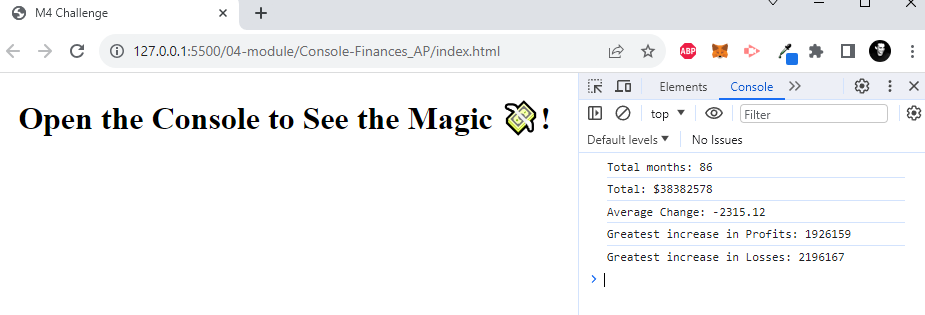

# Module 04 - Console Finances

## Description 

This is a short project that uses javascript to calculate the following, based on the finances provided:

1. Number of months
2. Total balance
3. Average Month-on-Month Change
4. Largest increase in Profits
5. Largest increase in Losses

## Usage 

Visit [The deployed page](https://lxpap.github.io/Console-Finances_AP/) and open developer tools by using F12, and clicking on "Console" to see the results.

## Credits

Sources used for research:
[Stack Overflow](https://stackoverflow.com/)
[ChatGPT](https://chat.openai.com/)

## License

You can find a copy of the MIT License in the repository.

